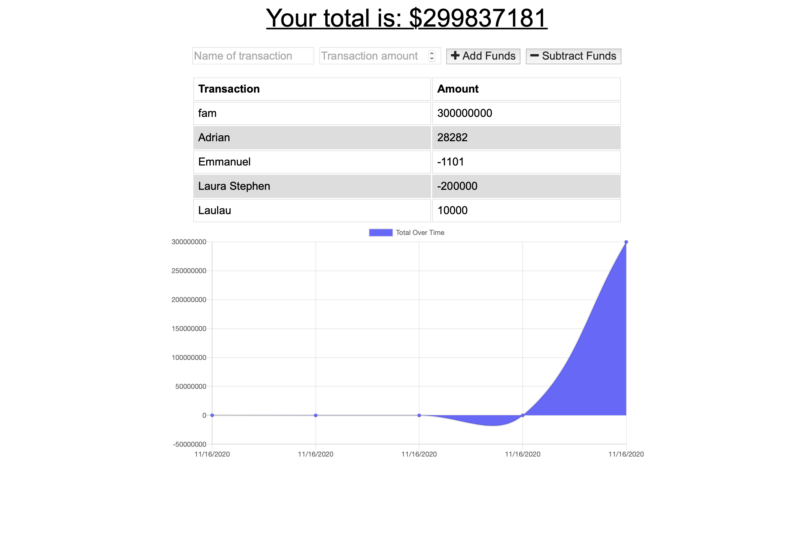
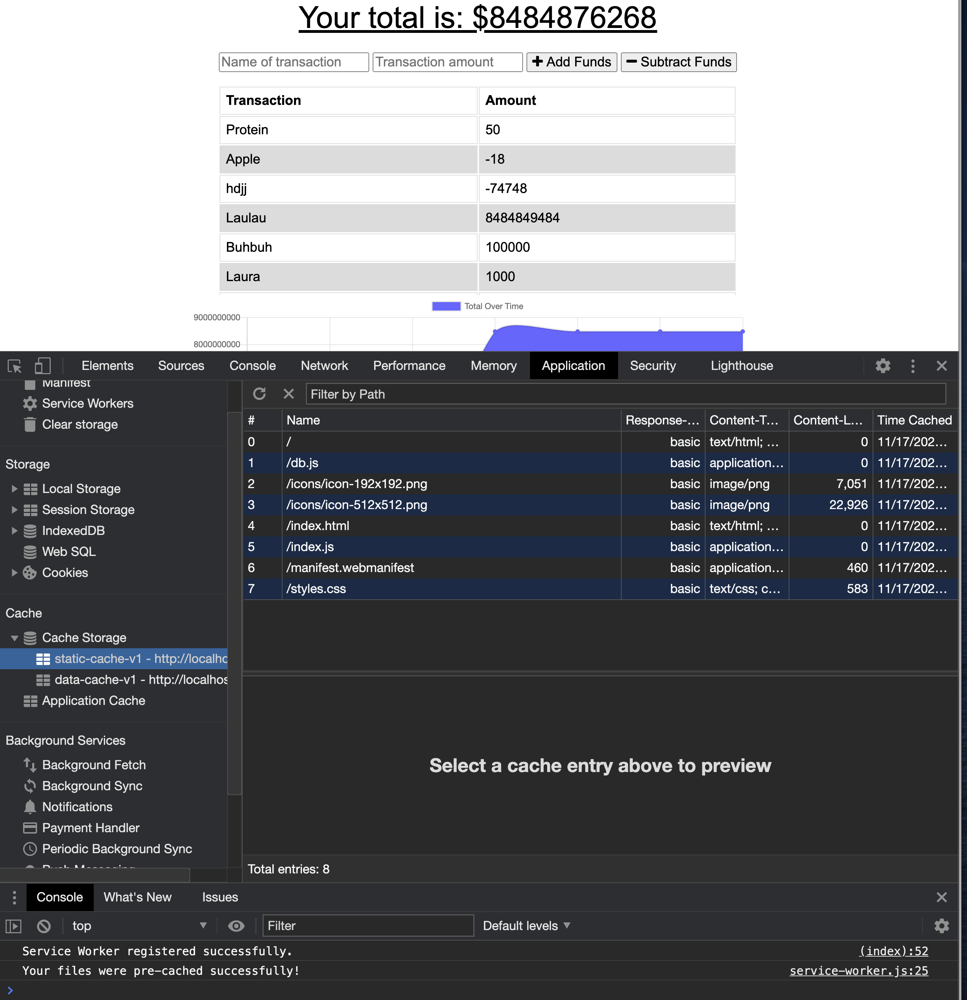

## Online-Offline-Budget-Trackers

## [Click to access deployed version](https://my-on-offline-budget-tracker.herokuapp.com)

## Purpose

Add functionality to our existing Budget Tracker application to allow for offline access and functionality.

The user will be able to add expenses and deposits to their budget with or without a connection. When entering transactions offline, they should populate the total when brought back online.

Offline Functionality:

  * Enter deposits offline

  * Enter expenses offline

When brought back online:

  * Offline entries should be added to tracker.

## Tech Used

* HTML
* CSS
* JavaScript
* Node
* Express
* MongoDB/Atlas
* Mongoose

